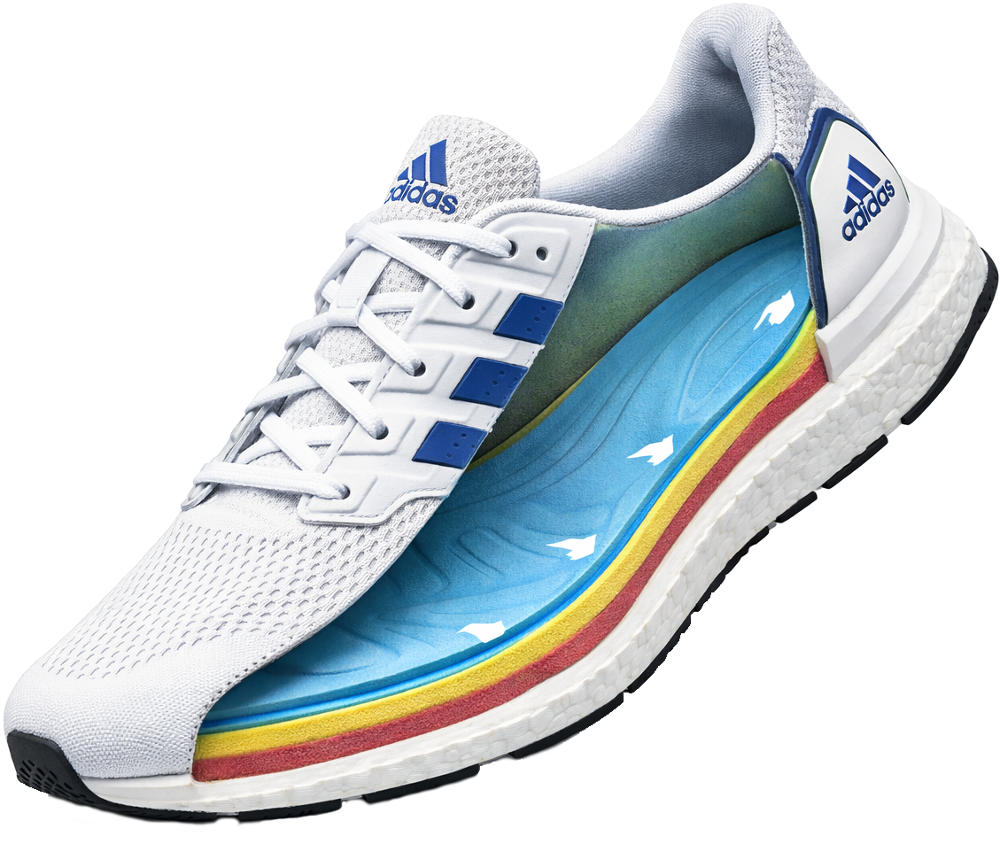
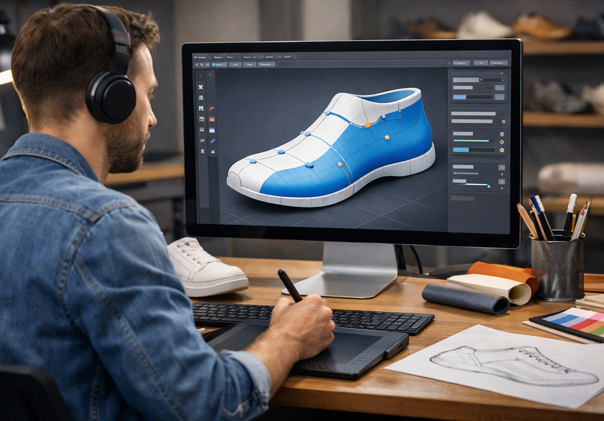
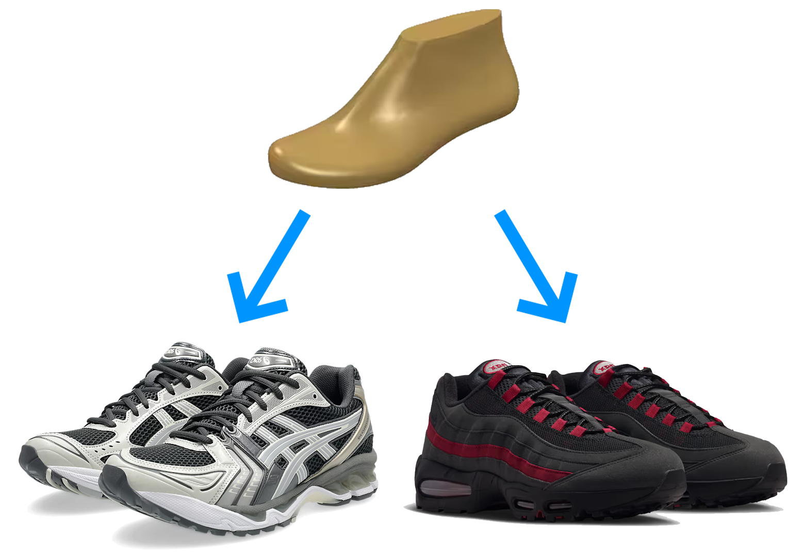
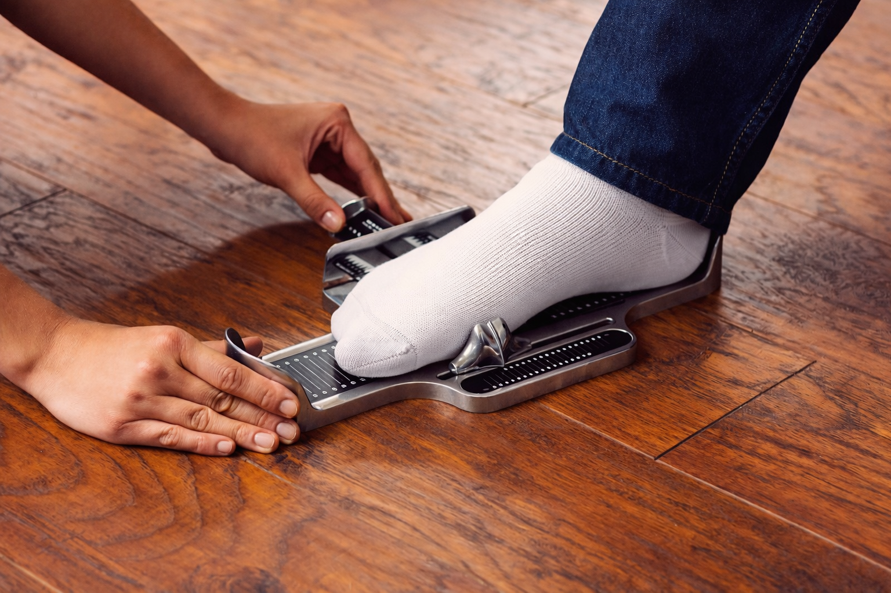
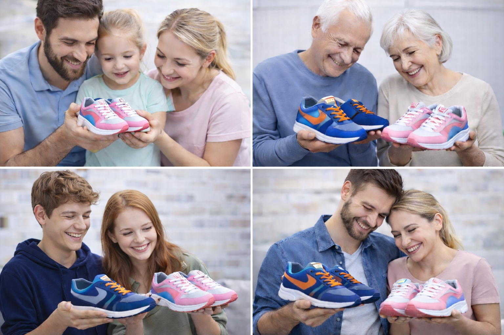

<!DOCTYPE html>
<html lang="en">
<head>
    <meta charset="UTF-8">
    <meta name="viewport" content="width=device-width, initial-scale=1.0">
    <meta name="author" content="Teodor Šešum | teodor1125@its.edu.rs">
    <title>EasyFit patike</title>
    <link rel="stylesheet" href="./css/bootstrap.min.css">
    <link rel="stylesheet" href="./css/index-style.css">
</head>
<body style="background-color: #b3d3ff;">
    <!-- Header i navigacija -->
    <header style="background-color: #334B71;">
        <nav class="py-2 text-white">
            

                
                <ul class="nav me-auto">
                    <li class="nav-item"><a href="#staNudimo" class="nav-link link-light px-2">Šta nudimo</a></li>
                    <li class="nav-item"><a href="#procesIzradePatika" class="nav-link link-light px-2">Proces izrade patika</a></li>
                    <li class="nav-item"><a href="#kontakt" class="nav-link link-light px-2">Kontakt</a></li>
                </ul>
                <ul class="nav">
                    <li class="nav-item"><a href="#vazno" class="nav-link link-light px-2">Login</a></li>
                    <li class="nav-item"><a href="#vazno" class="nav-link link-light px-2">Registracija</a></li>
                </ul>
            

        </nav>
    </header>
    <main role="main">
        <!-- Hero i CTA -->
        <section class="d-flex justify-content-center text-white py-4" style="background-color: #4c71aa;">
            

                

                    

                        <h1 class="mb-4 fw-bold" style="text-shadow: 0px 3px 10px black">
                            Udobne i atraktivne 
                            patike po Vašoj meri
                        </h1>
                        

                            <i><b>EasyFit</b></i> je biznis sa ciljem da
                            <u>pojednostavi, pojeftini i približi</u>
                            proces kreiranja kalupa patika
                            po meri Vaših stopala.
                        

                        

                            Imate <u>osetljiva stopala, ravna stopala, visok ris</u>...?
                            <b><i>EasyFit</i></b> je rešenje za Vas!
                        

                    

                    

                        <a href="#vazno" class="btn btn-warning border-light fs-6">Kreirajte kalup</a>
                        
- ili, ako ste ga kreirali -

                        <a href="#vazno" class="btn btn-info border-light fs-6">Izaberite dizajn patika</a>
                    

                

                

                    
                

            

        </section>
        <!-- Šta nudimo? -->
        <section id="staNudimo" class="py-5 d-flex flex-column justify-content-center align-items-center" style="background-color: #6892d3">
            

                

                    <h2 class="section-heading text-white fw-bold" style="text-shadow: 0 3px 10px black">Šta nudimo?</h2>
                

                

                    

                        

                            
                            

                                <h4 class="card-title text-center">🔍 Kraj beskrajnom traganju za patikama</h5>
                                
Zaboravite isprobavanje brojnih modela patika i razočarenja zbog neudobnosti. Sa <i><b>EasyFit</b></i>, kreiran kalup se primenjuje na svaki naručeni par.

                            

                        

                    

                    

                        

                            
                            

                                <h4 class="card-title text-center">🦶 Izrada personalizovanog kalupa</h5>
                                
Kreiramo jedinstven kalup patika po merama Vaših stopala. Rezultat su patike koje pružaju maksimalnu udobnost pri svakom koraku.

                            

                        

                    

                    

                        

                            
                            

                                <h4 class="card-title text-center">👟 Jedan kalup – više modela patika</h5>
                                
Izaberite bilo koji <i><b>EasyFit</b></i> dizajn, bez kompromisa po pitanju udobnosti. Imaćete osećaj se kao da nosite svoj omiljeni par patika.

                            

                        

                    

                

            

        </section>
        <!-- Proces izrade patika -->
        <section id="procesIzradePatika" class="py-5" style="background-color: #81aae7;">
            

                

                    <h2 class="section-heading text-white fw-bold" style="text-shadow: 0 3px 10px black">Proces izrade patika</h2>
                

                

                    

                        <button type="button" data-bs-target="#carouselExampleCaptions" data-bs-slide-to="0" class="active bg-dark" aria-current="true" aria-label="Slide 1"></button>
                        <button type="button" data-bs-target="#carouselExampleCaptions" data-bs-slide-to="1" class="bg-dark" aria-label="Slide 2"></button>
                        <button type="button" data-bs-target="#carouselExampleCaptions" data-bs-slide-to="2" class="bg-dark" aria-label="Slide 3"></button>
                        <button type="button" data-bs-target="#carouselExampleCaptions" data-bs-slide-to="3" class="bg-dark" aria-label="Slide 4"></button>
                    

                    

                        

                            
                            

                                <h4 class="text-decoration-underline" style="color: #032a69;">1. Kreiranje kalupa</h4>
                                
 U <i><b>EasyFit</b></i> lokalima ili ovlašćenim prodavnicama patika merimo Vaša stopala i kreiramo kalup. Kalup se po potrebi dodatno prilagođava, kako bi pristajanje bilo savršeno.

                            

                        

                        

                            
                            

                                <h4 class="text-decoration-underline" style="color: #032a69;">2. Izbor dizajna</h4>
                                
Vi birate željeni dizajn patika putem sajta. Vaš kalup se primenjuje na izabrani dizajn, bez brige o udobnosti.

                            

                        

                        

                            
                            

                                <h4 class="text-decoration-underline" style="color: #032a69;">3. Proizvodnja</h4>
                                
Nakon poručivanja, započinje proizvodnja patika po Vašem kalupu i izabranom dizajnu. Svaki par se proizvodi sa posvećenošću i pažnjom, kako bi zadržao kvalitet i udobnost.

                            

                        

                        

                            
                            

                                <h4 class="text-decoration-underline" style="color: #032a69;">4. Dostava i preuzimanje patika</h4>
                                
Patike izrađene po merama Vaših stopala, spremne za udobno nošenje od prvog koraka, dostavljamo na Vašu adresu ili u izabranu prodavnicu.

                            

                        

                    

                    <button class="carousel-control-prev" type="button" data-bs-target="#carouselExampleCaptions" data-bs-slide="prev">
                        
                        Previous
                    </button>
                    <button class="carousel-control-next" type="button" data-bs-target="#carouselExampleCaptions" data-bs-slide="next">
                        
                        Next
                    </button>
                

            

        </section>
        <!-- Kontakt i ostale informacije -->
        <section class="p-0" style="background-color: #AAC5EE;">
            

                

                    

                        
                    

                    

                        

                            Telefon: +381 61 123 1234 
                            Email: support@easyfit.com
                        

                    

                    

                        
Sajt je deo projekta planiranog Nastavnog plana i programa za predmet Preduzetništvo u IT, prve godine master strukovnih studija na Visokoj školi strukovnih studija za informacione tehnologije (ITS).
Kao takav, predstavlja imaginarni biznis u prethodno navedenu svrhu.

                    

                

                
            

        </section>
    </main>
    
</body>
</html>
